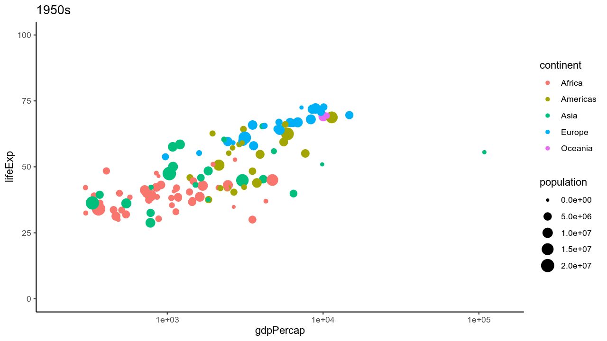
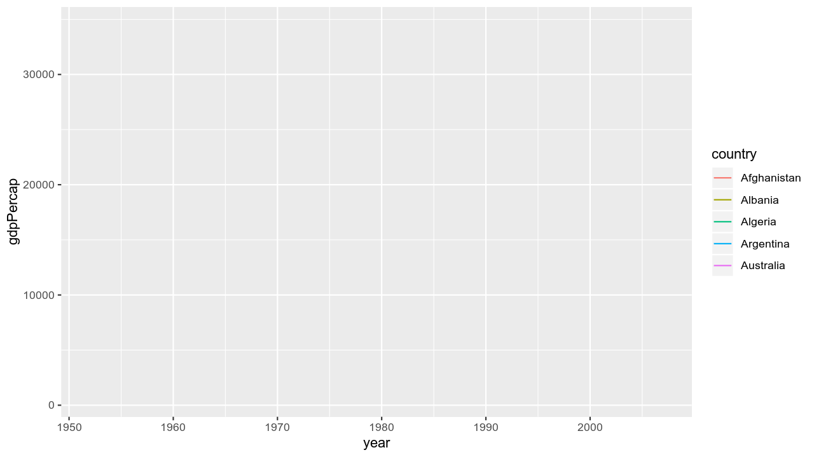

```{r setup, include=FALSE}
knitr::opts_chunk$set(fig.width=4.25, fig.height=3.5, fig.retina=3,
                      out.width = "100%",
                      message=FALSE, warning=FALSE, cache = TRUE, 
                      autodep = TRUE, hiline=TRUE)

knitr::opts_hooks$set(fig.callout = function(options) {
  if (options$fig.callout) {
    options$echo <- FALSE
    options$out.height <- "99%"
    options$fig.width <- 16
    options$fig.height <- 8
  }
  options
})

options(
  htmltools.dir.version = FALSE, 
  width = 90,
  max.print = 9999,
  knitr.table.format = "html"
)

as_table <- function(...) knitr::kable(..., format='html', digits = 3)
```

layout: true
# Why develop animations?
---

.pull-left[

## Pros

- Visualization in multiple dimensions
- Impactful
- Accessible

]

.pull-right[

## 

]

---
layout: true
# Why develop animations? Or not...
---

.pull-left[

## Pros

- Visualization in multiple dimensions
- Impactful
- Accessible

]

.pull-right[

## Cons

- Visualization in multiple dimensions
- Not explorable
- Inefficient file format (GIF)

]

---
layout: true
# How does all of this work anyway?
---

- Step 0. Open R graphics device

- Step 1. n-many individual frames are created as image files a directory.

- Step 2. Image files are appended, then removed
  - Method 1: `animation` package - calls Imagemagick or GraphicsMagick software dependencies
  - Method 2: `magick` package - ports the Imagemagick capabilities to R without dependencies (`gganimate` also features this capability)
  - Method 3: `gifski` package - ports the gifski capabilities to R without dependencies (`gganimate` also features this capability)

- Step 3. Animation is output and R graphics device is closed


---
class: section-slide
layout: true
---
# Lets make some animations!

---

class: fullscreen, top, center, text-white
background-image: url("images/allTheThings.png")

.font150[**ANIMATE ALL THE THINGS**]

---
layout: true
# Load libraries
---

```{r libraries}
# data source and graphics
library(gapminder)
library(ggplot2)

# data manipulation and interpolation
library(dplyr)
library(tweenr) # install_github("thomasp85/tweenr")

# animation
library(gganimate) # install_github("thomasp85/gganimate")
library(gifski)
library(magick)
library(animation)
```

---
layout: true
# What we'll be creating
---

## Chart Types
- Bubble Chart
- Bar Chart
- Line Chart

## Animation Packages
- gifski
- gganimate

---
class: section-slide
layout: true
---
# Bubble Charts

---
layout: true
# Bubble Chart - Static version
---

.left-code[
```{r gapminder-split-bubble, fig.show="hide"}
ggplot(gapminder,
  aes(x = gdpPercap,
      y = lifeExp,
      size = pop,
      color = continent)) +
geom_point() +
scale_x_log10() +
theme_classic()
```
]


.right-plot[
`)
]

---
layout: true
# Bubble Chart
---

- Data is split into a list of `data.frame`s
- Each `data.frame` is a frame in the animation

.codeScroll25[
```{r gapminder split}
datalist <- split(gapminder, gapminder$year)
datalist
```
]


---
layout: true
# Animation Development Workflow
---

1. 

2. Structure your data to create frames that move across the dimension of interest
  
3. 

4. 

---
layout: true
# Bubble Chart with gifski
---

.left-text-anim[
`makePlot()` will be passed to our function that saves the animation
  - iterates over each `data.frame` in our list
  
Know your limits
  - Full range of axes of axes used to set limits of the plot
]

.right-code-anim[
```{r gapminder-output-choppy2, results='hide', message=FALSE,  eval = FALSE, cache=TRUE}
makePlot <- function(){
  lapply(datalist, function(data){
    p <- ggplot(data, aes(x = gdpPercap,
                          y = lifeExp, 
                          size = pop, 
                          color = continent)) +
      scale_y_continuous(limits =c(0, 100)) + #<<
      geom_point() +
      scale_x_log10(limits =  c(200, 140000)) + #<<
      scale_size("population", limits=c(0,21000000)) + #<<
      guides(color = guide_legend(order=1), #<<
             size = guide_legend(order=2)) + #<<
      ggtitle(paste0(round(data$year,-1), "s")) +
      theme_classic()
    print(p)
  })
}
gif_file <- file.path(paste0(getwd(), '/images/gifskiGapminderBubbleChoppy.gif'))
save_gif(makePlot(), gif_file, 1280, 720, res = 144, delay = .5)
```
]


---
layout: true
# Animation Development Workflow
---

1. 

2. Structure your data to create frames that move across the dimension of interest
  
3. Determine plot aspects that require consistency across the animation (annotations, scales, legends, etc)

4. 

---
layout: true
# Bubble Chart with gifski
---

.left-text-anim[
`makePlot()` will be passed to our function that saves the animation
  - iterates over each `data.frame` in our list
  
Know your limits
  - Full range of axes of axes used to set limits of the plot
]

.right-code-anim[
```{r gapminder-output-choppy, results='hide', message=FALSE,  eval = FALSE, cache=TRUE}
makePlot <- function(){
  lapply(datalist, function(data){
    p <- ggplot(data, aes(x = gdpPercap,
                          y = lifeExp, 
                          size = pop, 
                          color = continent)) +
      scale_y_continuous(limits =c(0, 100)) + #<<
      geom_point() +
      scale_x_log10(limits =  c(200, 140000)) + #<<
      scale_size("population", limits=c(0,21000000)) + #<<
      guides(color = guide_legend(order=1), #<<
             size = guide_legend(order=2)) + #<<
      ggtitle(paste0(round(data$year,-1), "s")) +
      theme_classic()
    print(p)
  })
}
gif_file <- file.path(paste0(getwd(), '/images/gifskiGapminderBubbleChoppy.gif'))
save_gif(makePlot(), gif_file, 1280, 720, res = 144, delay = .5)
```
]

---
layout: true
# Bubble Chart with gifski
---



---
class: section-slide
layout: true
---
# How do we get smooth animations?

---
layout: true
# Data Interpolation Using tweenr
---

- specify the rate of change of a parameter over time

https://easings.net/


```{r easings, echo=FALSE, out.width='50%', out.height='50%'}
knitr::include_graphics('images/easings.png')
```

---
layout: true
# Data Interpolation Using tweenr
---

.codeScroll25[
```{r tween}
datTweened <- tween_states(data = datalist,
                           tweenlength = 2, statelength = 1,
                           ease = 'linear', nframes = 100)
unique(datTweened$year)
```
]


Split `dat` back into a `list`
```{r recreate datalist}
datalistTweened <- split(datTweened, datTweened$year)
```

---
layout: true
# Workflow
---

1. Interpolate your data

2. Structure your data to create frames that move across the dimension of interest
  
3. Determine plot aspects that require consistency across the animation (annotations, scales, legends, etc)

4. 

---
layout: true
# Bubble Chart with gifski
---

.left-text-anim[
In `makePlot()`, each `data.frame` in the  list `datalistTweened` is created and printed by the graphics device
]

.right-code-anim[
```{r gapminder-bubble-gifski, fig.show="hide", eval = TRUE, cache=TRUE}
makePlot <- function(){
  lapply(datalistTweened, function(data){ #<<
    p <- ggplot(data, aes(x = gdpPercap,
                          y = lifeExp, 
                          size = pop, 
                          color = continent)) +
      scale_y_continuous(limits =c(0, 100)) +
      geom_point() +
      scale_x_log10(limits =  c(200, 140000)) +
      scale_size("population", limits=c(0,21000000)) +
      guides(color = guide_legend(order=1),
             size = guide_legend(order=2)) +
      ggtitle(paste0(round(data$year,-1), "s")) +
      theme_classic()
    print(p) #<<
  })
}

``` 
]

---
layout: true
# Bubble Chart with gifski
---

.left-code[
```{r gifskiGapminderBubbble, message= FALSE, warning=FALSE, eval = FALSE, cache=TRUE}
save_gif(
  expr = makePlot(),
  gif_file = 'images/gifskiGapminderBubbble.gif',
  width = 1280, height = 720,
  res = 144, delay = .05
)
```
]

.right-plot[

]


---
layout: true
# Workflow
---

1. Interpolate your data

2. Structure your data to create frames that move across the dimension of interest
  
3. Determine plot aspects that require consistency across the animation (annotations, scales, legends, etc)

4. Append and export the frames


---
layout: true
# Bubble Chart with gganimate
---

.left-text-anim[
`gganimate` doesn't require data preparation (interpolation) before plotting
  - `transition_time`: indicates the variable to interpolate data over (`year`)
  - `ease_aes`: indicates the easing method
Sets our plot limits by default! :D
]

.right-code-anim[
```{r gapminder-bubble-gganimate, fig.show="hide", eval = TRUE, cache=TRUE}
p <- ggplot(gapminder,
            aes(x = gdpPercap,
                y = lifeExp,
                size = pop,
                color = continent)
            ) +
    geom_point() + theme_classic() +
	  # Here comes the gganimate specific bits
	  transition_time(year) + #<<
	  ease_aes('linear') #<<
```
]

---
layout: true
# Workflow
---

1. Interpolate your data

2. Structure your data to create frames that move across the dimension of interest
  
3. Determine plot aspects that require consistency across the animation (annotations, scales, legends, etc)

## gganimate does these internally!

---
layout: true
# Bubble Chart with gganimate
---

.left-code[
```{r gganimateGapminderBubbble, message= FALSE, warning=FALSE, eval = FALSE, cache=TRUE}
animation <- animate(
  plot = p,
  width = 1280,
  eight = 720,
  res = 144,
  fps = 20)

anim_save(
  filename = 'gganimateGapminderBubbble.gif',
  animation = animation
)
```
]

.right-plot[

]

---
class: section-slide
layout: true
---
# Bar Charts

---
layout: true
# Bar Chart - Static version
---

.left-code[
```{r gapminder-split-bar, fig.show="hide"}
ggplot(gapminder,
  aes(x = gdpPercap,
      y = lifeExp,
      size = pop,
      color = continent)) +
geom_point() +
scale_x_log10() +
theme_classic()
```
]


.right-plot[
`)
]

---
layout: true
#  Bar Chart - Static version
---

.left-code[

```{r gapminder-bar, fig.show="hide"}
# subset gapminder countries
countries <- gapminder %>% filter(country %in% c("Afghanistan", "Albania", "Algeria", "Argentina", "Australia"))

ggplot(subset(countries,
              year == max(countries$year)),
      aes(x = country,
           y = gdpPercap,
           fill = country))+
      geom_col() + 
      scale_y_continuous(limits = c(0,40000)) +
      theme_classic()
```
]


.right-plot[
`)
]

---
layout: true
# Bar Chart with gifski
---

Interpolate our data by country and reappend as a list

```{r barChart}
datalist <- split(countries, countries$year,drop = TRUE)
datTweened <- tween_states(datalist, tweenlength = 1,
                           statelength = 0, 'linear', 100)
datalistTweened <- split(datTweened, datTweened$year)
```

---
layout: true
# Bar Chart with gifski
---

.left-text-anim[
`makePlot()` will be passed to our function that saves the animation
  - iterates over each `data.frame` in our list
  
Know your limits
  - Full range of axes of axes used to set limits of the plot
]

.right-code-anim[
```{r gapminder-bar-gifski, fig.show="hide", eval = TRUE, cache=TRUE}
makePlot <- function(){
  lapply(datalistTweened, function(data){
    p <- ggplot(data = data,
                aes(x = country,
                    y = gdpPercap,
                    fill = country)) +
      geom_col() + 
      scale_y_continuous(limits = c(0,40000)) + #<<
      ggtitle(paste0(round(data$year,-1), "s")) +
      theme_classic()
    print(p)
  })
}

``` 
]

---
layout: true
# Bar Chart with gifski
---

.left-code[
```{r gifskiGapminderBar, message= FALSE, warning=FALSE, eval = FALSE, cache=TRUE}
save_gif(
  expr = makePlot(), 
  gif_file = 'images/gifskiGapminderBar.gif',
  width = 720,
  height = 1280,
  res = 144,
  delay = .05
)
```
]

.right-plot[

]

---
layout: true
# Bar Chart with gganimate
---

.left-text-anim[
`gganimate` doesn't require data preparation (interpolation) before plotting
  - `transition_states`: indicates the variable to interpolate data over (`year`)
  - `ease_aes`: indicates the easing method
]

.right-code-anim[
```{r gapminder-bar-gganimate, fig.show="hide", eval = TRUE, cache=TRUE}
p <- ggplot(data = countries, aes(country, gdpPercap, fill = country)) +
  geom_col() +
  ggtitle(countries$year) +
  theme_classic() +
  transition_states(states = year, transition_length = 3, state_length = 1) + #<<
  ease_aes('linear')
```
]

---
layout: true
# Bar Chart with gganimate
---

.left-code[
```{r gganimateGapminderBar, message= FALSE, warning=FALSE, eval = FALSE, cache=TRUE}
animation <- animate(
  plot = p,
  width = 720,
  height = 1280,
  res = 144,
  fps = 20)

anim_save(
  filename = 'gganimateGapminderBar.gif',
  animation = animation
)
```
]

.right-plot[

]

---
class: section-slide
layout: true
---
# Line Charts


---
layout: true
#  Line Chart - Static version
---

.left-code[
```{r gapminder-line, fig.show="hide"}
ggplot(data = countries,
       aes(x = year,y = gdpPercap,
           color = country, group = country)) +
      geom_line()  +
      scale_x_continuous(limits = range(countries$year)) + 
      scale_y_continuous(limits = c(0,40000))
```
]

.right-plot[
`)
]

---
layout: true
# Line Chart with gifski
---

.left-text-anim[
- use the `datTweened` data frame we interpolated from the 5 countries
  
- each frame includes all earlier data
- iterate across the length of a data set
]

.right-code-anim[
```{r gapminder-Line-gifski, fig.show="hide", eval = TRUE, cache=TRUE}
makePlot <- function(){
  for (i in 1:max(datTweened$.frame)) { #<<
    p <- ggplot(data = subset(datTweened, .frame <= i), #<<
                aes(x = year,y = gdpPercap,
                    color = country, group = country)) +
      geom_line()  +
      scale_x_continuous(limits = range(datTweened$year)) + 
      scale_y_continuous(limits = c(0,40000))
    print(p)
  }
}

``` 
]

---
layout: true
# Line Chart with gifski
---

.left-code[
```{r gifskiGapminderLine, message= FALSE, message= FALSE, warning=FALSE, eval = TRUE, cache=TRUE}
save_gif(
  expr = makePlot(), 
  gif_file = 'images/gifskiGapminderLine.gif',
  width = 1280,
  height = 720,
  res = 144,
  delay = .05
)
```
]

.right-plot[

]

---
layout: true
# Line Chart with gganimate
---

.left-text-anim[
- `transition_reveal`: indicates the variable id with which data appear, based along a dimension
]

.right-code-anim[
```{r gapminder-Line-gganimate, fig.show="hide", eval = TRUE, cache=TRUE}
p <- ggplot(data = countries,
            aes(x = year, y = gdpPercap,
                  color = country, group = country)) +
    geom_line() +
    transition_reveal(id=country, along=year) + #<<
    ease_aes('linear')
```
]

---
layout: true
# Line Chart with gganimate
---

.left-code[
```{r gganimateGapminderLine, message= FALSE, warning=FALSE, eval = FALSE, cache=TRUE}
animation <- animate(
  plot = p,
  width = 1280,
  height = 720,
  res = 144,
  fps = 20)

anim_save(
  filename = 'gganimateGapminderLine.gif',
  animation = animation
)
```
]

.right-plot[

]

---
layout: true
# Use gifsicle for more efficient gifs
---

[Gifsicle](https://www.lcdf.org/gifsicle/) is a command-line tool for creating, editing, and getting information about GIF images and animations.

```{r gifsicle}
# sourced from https://stla.github.io/stlapblog/posts/AnimatedGifs.html
gif_compress <- function(ingif, outgif, show=TRUE, extra.opts=""){
  command <-  sprintf("gifsicle -O3 %s < %s > %s", extra.opts, ingif, outgif)
  system.fun <- if (.Platform$OS.type == "windows") shell else system
  if(show) message("Executing: ", strwrap(command, exdent = 2, prefix = "\n"))
  system.fun(ifelse(.Platform$OS.type == "windows", sprintf("\"%s\"", shQuote(command)), command))
}
gif_compress("gganimateGapminderLine.gif","gganimateGapminderLineGifsicle.gif", extra.opts = "--colors 256")
```


---
layout: true
# Closing Notes
---

- `gifski`, `magick`, and `animation` packages can be expanded as far as your imagination

```{r wrap up, fig.show="hide", eval = FALSE, cache=TRUE}
makePlot <- function(){
  for (i in 1:max(datTweened$.frame)) {
    p <- ggplot(data = subset(datTweened, .frame <= i),
                aes(x = year,y = gdpPercap,
                    color = country, group = country)) +
      geom_line()  +
      scale_x_continuous(limits = range(datTweened$year)) + 
      scale_y_continuous(limits = c(0,40000))
    print(p)
  }
  ... #<<
  # more frames can be added!

}

``` 

- gganimate is refined and also under development

---
layout: true
# Workflow
---

1. Interpolate your data

2. Structure your data to create frames that move across the dimension of interest
  
3. Determine plot aspects that require consistency across the animation (annotations, scales, legends, etc)

4. Append and export the frames

---

class: fullscreen, top, center, text-white
background-image: url("images/allTheThings.png")

.font150[**ANIMATE ALL THE THINGS**]
